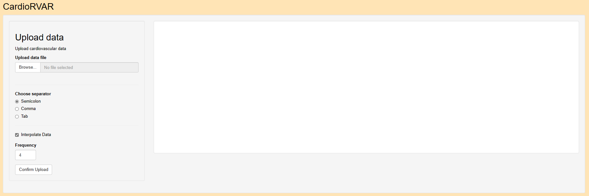
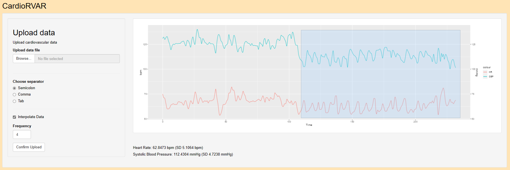
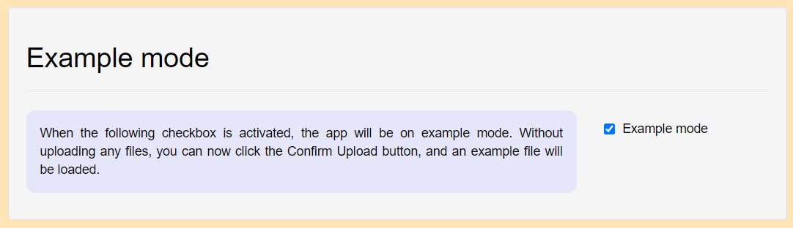
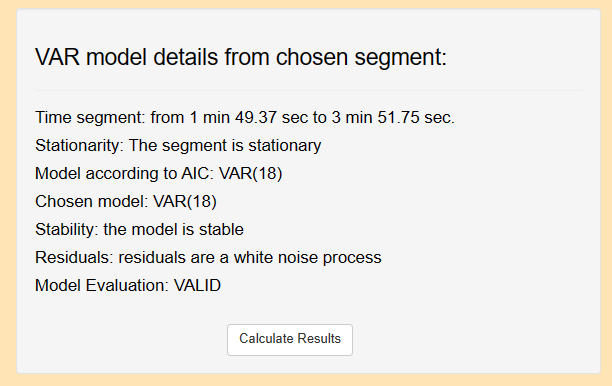
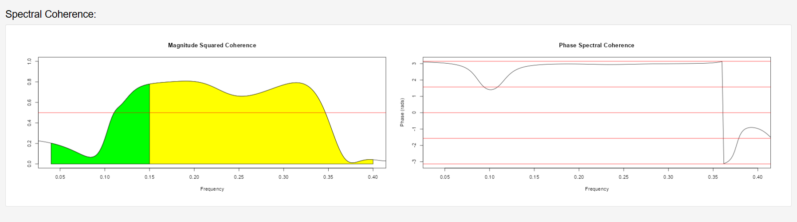
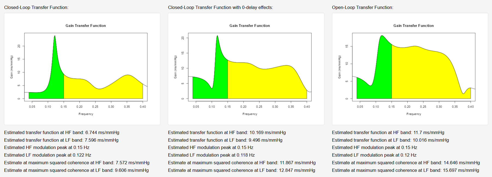
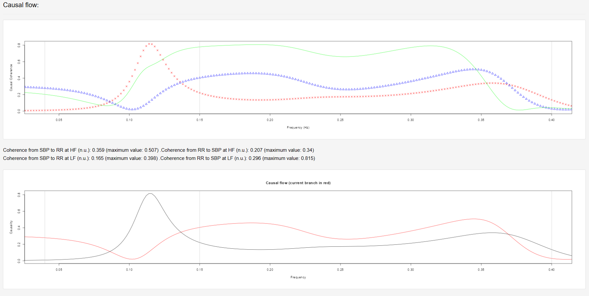
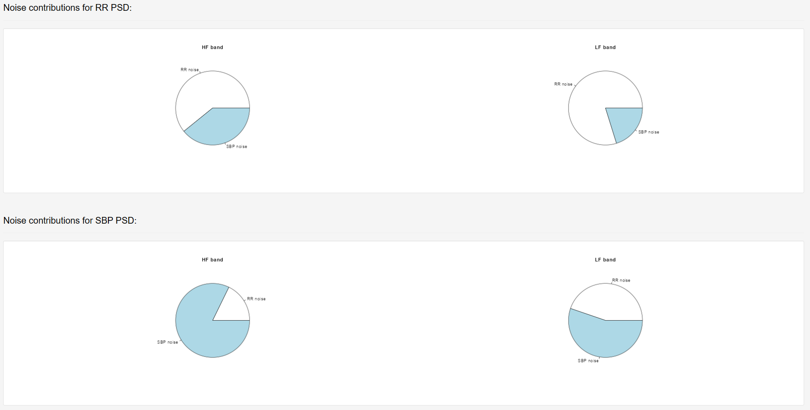
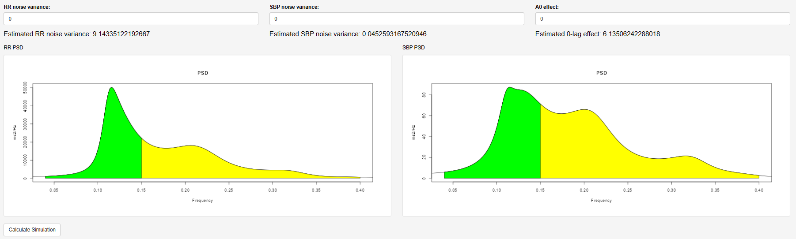
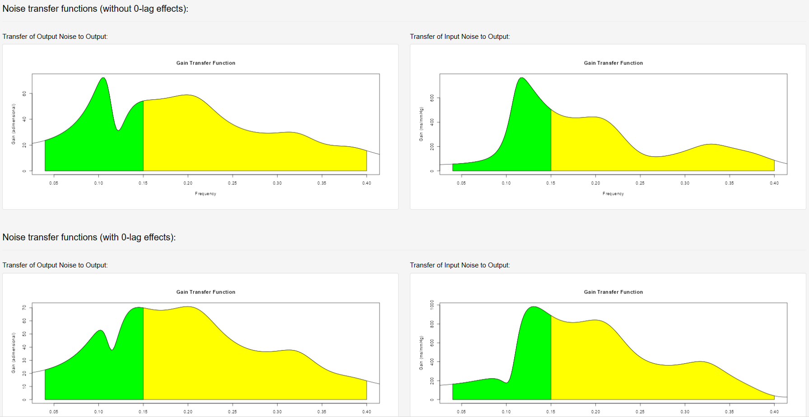

```{r, include = FALSE}
knitr::opts_chunk$set(
  collapse = TRUE,
  comment = "#>"
)
```
This tutorial has been designed to explore the basic functionalities of CardioRVARapp.
To start the app, use the following:


```{r setup, eval = FALSE}
library(CardioRVARapp)
library(shiny)
StartCardioRVARapp()

# Or alternatively:

CardioRVARapp::StartCardioRVARapp()
```

## 1. Upload data


This is the upload window:

```{r Figure 1, echo = FALSE, fig.align = "center", fig.caption = "Fig. 1.",out.width="100%", out.height="100%"}

```

You may add a file (either .csv or .txt) to the file box and click on "Confirm Upload" to load the file.
You may select an interpolation frequency (by default 4 Hz) to resample the data. Using the file
with the Cardiovascular data, you may get the following output:

```{r Figure 2, echo = FALSE, fig.align = "center", fig.caption = "Fig. 2.",out.width="100%", out.height="100%"}

```


You can use the following piece of code to save the data in Cardiovascular in a .txt file:

```{r Get data, eval = FALSE}
library(CardioRVAR)

data(Cardiovascular)

write.table(Cardiovascular, "Example.txt", row.names = FALSE, quote =   FALSE)
```


## 2. Check your model

In the below figure you can see the diagnostics obtained from a chosen interval. When you click on 
"Calculate Results", a VAR(18) model will be computed and used to estimate a frequency domain model.

```{r Figure 3, echo = FALSE, fig.align = "center", fig.caption = "Fig. 3.",out.width="100%", out.height="100%"}

```

This model will have, as shown in the figure below, a specific input (BPV) and a specific output (HRV).
You can also define a zero-transfer path here:

```{r Figure 4, echo = FALSE, fig.align = "center", fig.caption = "Fig. 4.",out.width="100%", out.height="100%"}

```

## 3. Check your results

The figure bellow represents the spectral coherence and phase:

```{r Figure 5, echo = FALSE, fig.align = "center", fig.caption = "Fig. 5.",out.width="100%", out.height="100%"}

```


And here you can see different estimates of the BRS transfer function. From left to right: (1) Closed-loop
transfer function without 0-delay effects, (2) Closed-loop transfer function with 0-delay effects and (3)
Open-loop transfer function.

```{r Figure 6, echo = FALSE, fig.align = "center", fig.caption = "Fig. 6.",out.width="100%", out.height="100%"}

```


Here you can see the causal coherences and a comparison with the spectral coherence. The causal coherences
serve as an indicator of Granger-causality between the variables:

```{r Figure 7, echo = FALSE, fig.align = "center", fig.caption = "Fig. 7.",out.width="100%", out.height="100%"}
knitr::include_graphics("CardioRVARapp_figures/Figure7.png")
```

A related measurement, the noise-source contribution, also serves as a direct measurement of causality:


```{r Figure 8, echo = FALSE, fig.align = "center", fig.caption = "Fig. 8.",out.width="100%", out.height="100%"}

```

Here you can see the individual spectrograms computed from autoregressive models representing HRV and BPV:


```{r Figure 9, echo = FALSE, fig.align = "center", fig.caption = "Fig. 9.",out.width="100%", out.height="100%"}

```


And here you can see the same spectrograms computed from the closed-loop model. This allows you to simulate
several behaviors (that is, change the noise sources and 0-delay effects) to inspect how they affect the 
spectra if the transfer function is assumed to remain constant:


```{r Figure 10, echo = FALSE, fig.align = "center", fig.caption = "Fig. 10.",out.width="100%", out.height="100%"}
knitr::include_graphics("CardioRVARapp_figures/Figure10.png")
```


Finally, you can see here the transfer funtions of the noise-source model computed from the variables:
```{r Figure 11, echo = FALSE, fig.align = "center", fig.caption = "Fig. 11.",out.width="100%", out.height="100%"}

```


## When encountering an error:

Some actions, like uploading an unsupported type of file such as .doc file, will trigger an error. In such cases, an error message will be displayed at the bottom right of the interface, such as this one:

```{r Figure 12, echo = FALSE, fig.align = "center", fig.caption = "Fig. 12.",out.width="40%", out.height="40%"}

```

This error, for example, was triggered after trying to load a .doc file into the interface. A table with different error messages and their meaning will be created and updated.


